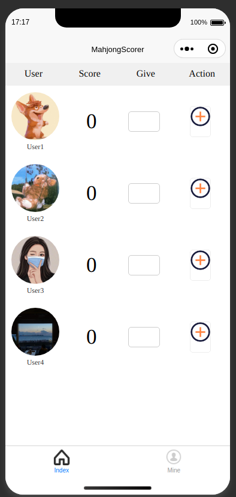

# MahjongScorer

This is a project to get started with WeChat mini program, which implement a simple mahjong scorer.

 

## IDE Setup

[neovim](https://neovim.io/) or [vscode](https://code.visualstudio.com/)


## Technology Stack

[vue 3](https://vuejs.org/) + [uni-app](https://uniapp.dcloud.net.cn/)


## Customize configuration

See [Uni-App Configuration Reference](https://uniapp.dcloud.net.cn/tutorial/).

## Project Setup

```sh
npm install
```

### Compile and Hot-Reload for Development

```sh
npm run dev:mp-weixin
```

After open this project's dist in WeChat Developer Tools.

### Compile and Minify for Production

```sh
npm run build
```

